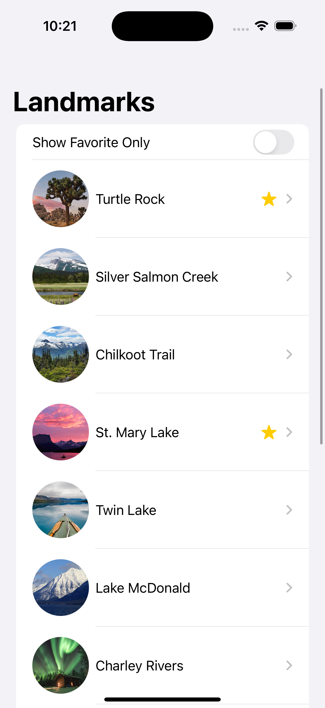
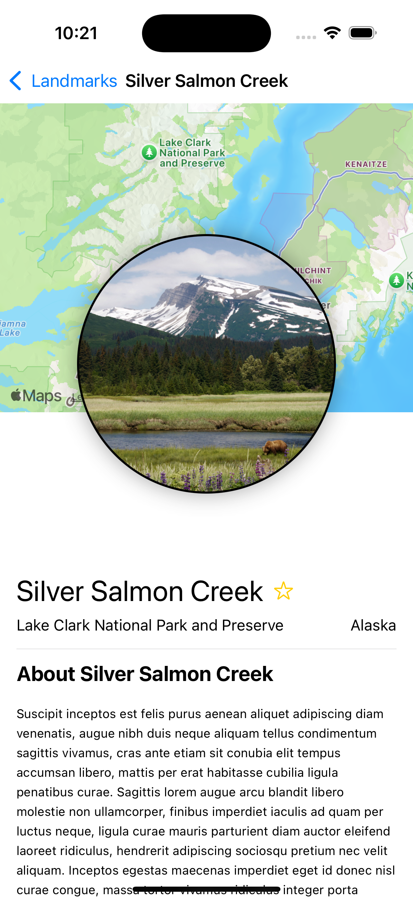

# 🗺️ LandmarkExplorer

A beautiful SwiftUI-based iOS app that allows users to browse and explore famous landmarks. This project is inspired by Apple's SwiftUI tutorials and showcases the use of lists, JSON decoding, navigation, and basic MVVM structure.

## 📱 Features

- 📍 Displays a list of landmarks with thumbnails
- 🖼️ Detailed views with full images and descriptions
- 🌐 Map integration using `MapKit`
- 💾 Loads data from bundled JSON file
- ✅ Built entirely in **SwiftUI**

## 🛠 Technologies Used

- Swift 5
- SwiftUI
- Xcode 15+
- MVVM Architecture
- Combine (ObservableObject, @Published)

## 📷 Screenshots

| Landmark List | Detail View |
|---------------|-------------|
|  |  |


## 🚀 Getting Started

### Prerequisites

- macOS Monterey or later
- Xcode 14 or later
- iOS 15.0+

### Installation

1. Clone the repository:

```bash
git clone https://github.com/yourusername/LandmarkExplorer.git
cd LandmarkExplorer
